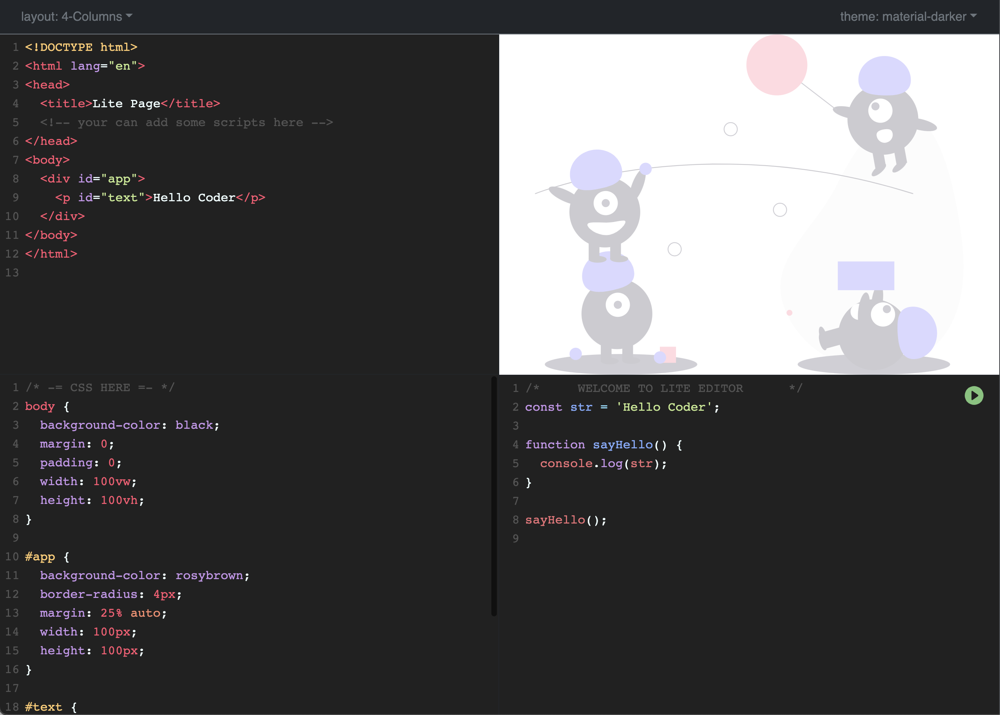
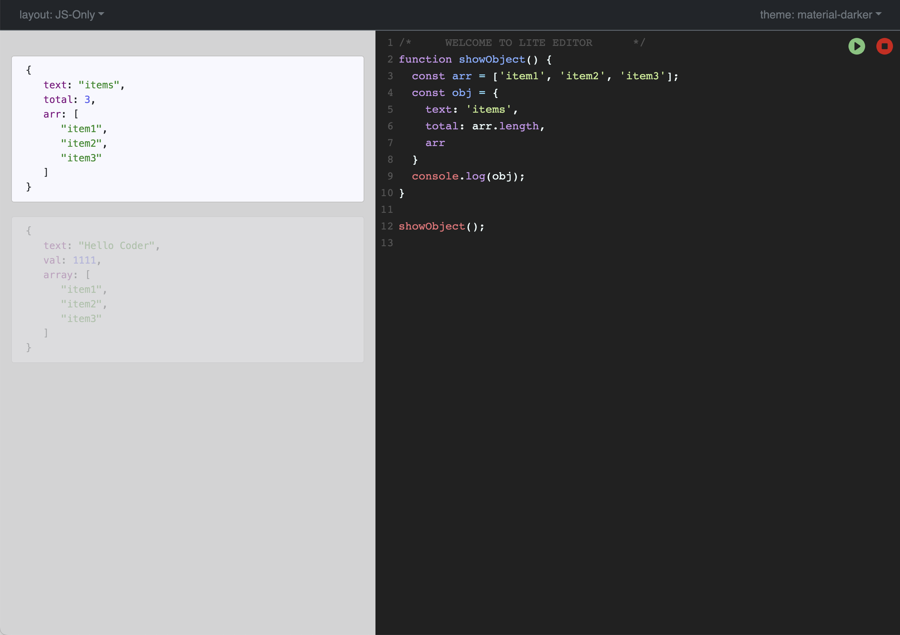

# [kostdev.github.io](https://kostdev.github.io/)

_Lite Code Editor for writing web page or code by js._

### Editor:

### Editor (layout: js-only):

### Plans:

1. [ ] Add Layouts optional: _in progress_
2. [ ] Add Save progress as templates: _in progress_
3. [ ] Add Modes:
   1. [ ] **Vue.js** 
   2. [ ] **React | jsx**
   3. [ ] **Markdown**
   4. [ ] **JSON**
   5. [ ] **XML**
4. [ ] Add option for adding libs
5. [ ] Live Code running
6. [ ] Auto save progress
7. [ ] Multiple files
